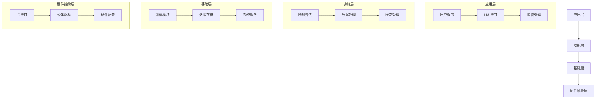
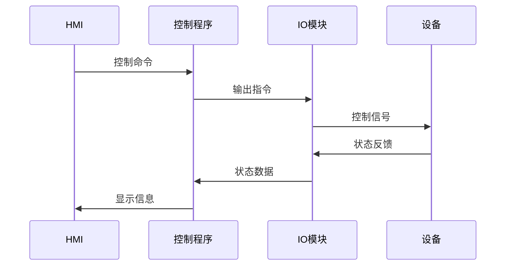
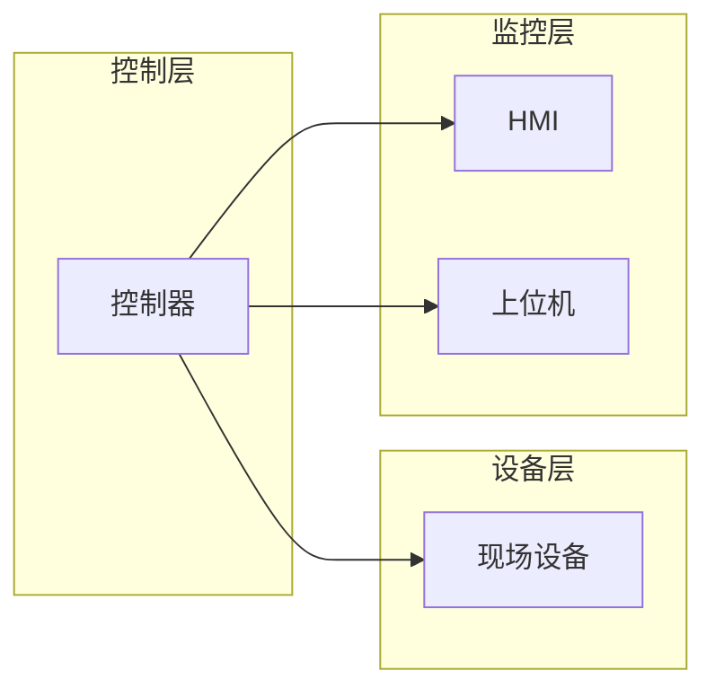

# 系统架构

[English](./system_architecture_EN.md) | [中文](./system_architecture_CN.md)

## 系统概览
本项目采用分层架构设计，清晰划分各个功能模块的职责和边界。

## 架构层次

## 模块说明

### 1. 应用层
- 用户程序：实现具体的应用逻辑
- HMI接口：提供人机交互界面
- 报警处理：处理系统报警和事件

### 2. 功能层
- 控制算法：PID、序列控制等
- 数据处理：数据过滤、转换等
- 状态管理：系统状态维护

### 3. 基础层
- 通信模块：各类通信协议实现
- 数据存储：数据缓存和持久化
- 系统服务：基础功能服务

### 4. 硬件抽象层
- IO接口：输入输出接口抽象
- 设备驱动：硬件驱动程序
- 硬件配置：硬件相关的配置

## 数据流向

## 接口定义

### 1. 外部接口
- Modbus TCP/IP
- OPC UA
- Profinet
- EtherCAT

### 2. 内部接口
- 模块间通信接口
- 数据交换接口
- 配置接口

## 部署视图

## 性能考虑
1. 实时性要求
   - 控制周期：≤ 10ms
   - 响应时间：≤ 50ms
   - 抖动控制：≤ 1ms

2. 资源占用
   - CPU负载：≤ 60%
   - 内存使用：≤ 50%
   - 存储空间：根据实际需求
