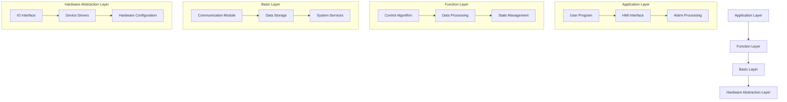
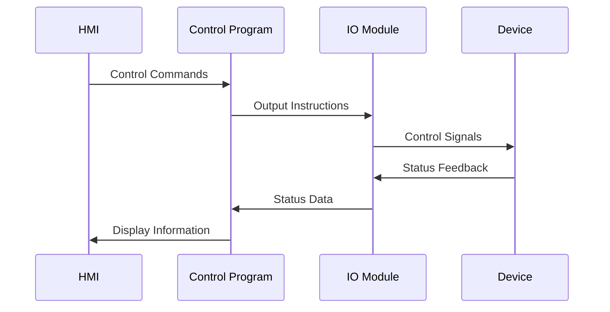
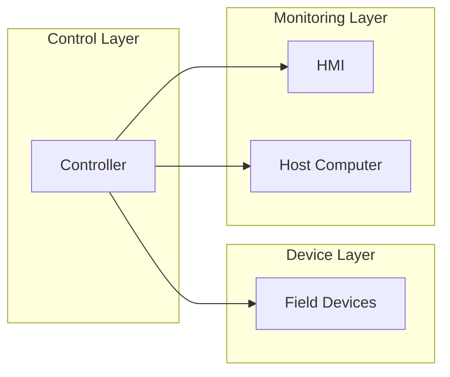

# System Architecture

[English](./system_architecture_EN.md) | [中文](./system_architecture_CN.md)

## System Overview
This project adopts a layered architecture design, clearly defining the responsibilities and boundaries of each functional module.

## Architecture Layers

## Module Description

### 1. Application Layer
- User Program: Implements specific application logic
- HMI Interface: Provides human-machine interaction interface
- Alarm Processing: Handles system alarms and events

### 2. Function Layer
- Control Algorithm: PID, sequence control, etc.
- Data Processing: Data filtering, conversion, etc.
- State Management: System state maintenance

### 3. Basic Layer
- Communication Module: Various communication protocol implementations
- Data Storage: Data caching and persistence
- System Services: Basic functional services

### 4. Hardware Abstraction Layer
- IO Interface: Input/output interface abstraction
- Device Drivers: Hardware driver programs
- Hardware Configuration: Hardware-related configuration

## Data Flow

## Interface Definitions

### 1. External Interfaces
- Modbus TCP/IP
- OPC UA
- Profinet
- EtherCAT

### 2. Internal Interfaces
- Inter-module Communication
- Data Exchange
- Configuration Interface

## Deployment View

## Performance Considerations
1. Real-time Requirements
   - Control Cycle: ≤ 10ms
   - Response Time: ≤ 50ms
   - Jitter Control: ≤ 1ms

2. Resource Usage
   - CPU Load: ≤ 60%
   - Memory Usage: ≤ 50%
   - Storage Space: As per actual requirements
